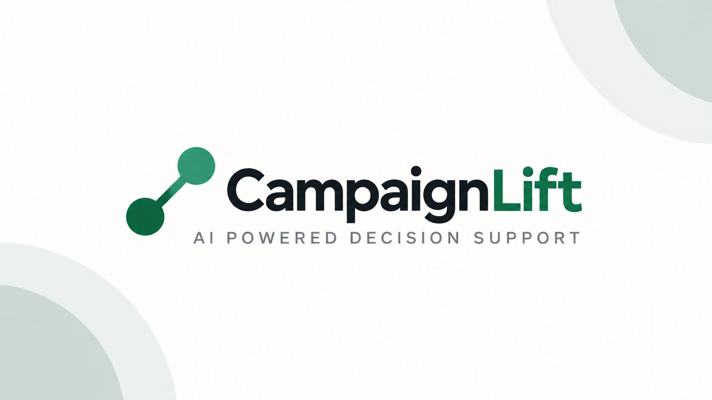
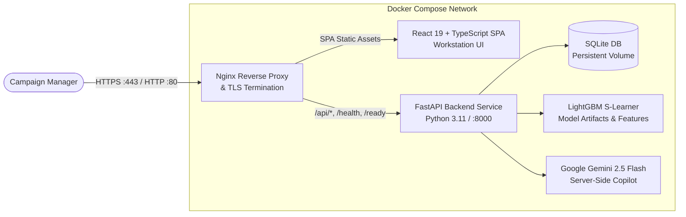

<p align="center">
  
</p>

<h1 align="center">CampaignLift</h1>

<p align="center">
  CampaignLift is an AI-powered campaign decision intelligence engine that helps identify customers with the highest incremental response to an offer using uplift modeling and campaign optimization.
</p>

<p align="center">
  <strong>Track:</strong> Track 04 — Growth &amp; Campaign Intelligence &nbsp;|&nbsp; <strong>Challenge:</strong> AI DEV FEST 2026 AI Hackathon
</p>

<p align="center">
  <strong>Live Demo:</strong> <a href="https://devtree.online/">https://devtree.online/</a>
</p>

<p align="center">
  <a href="https://devtree.online/">
    
  </a>
  <a href="https://github.com/mosabbir-maruf/CampaignLift-Hackathon/actions/workflows/ci-cd.yml">
    
  </a>
  <a href="https://github.com/mosabbir-maruf/CampaignLift-Hackathon/pkgs/container/campaignlift-backend">
    
  </a>
  <a href="https://github.com/mosabbir-maruf/CampaignLift-Hackathon/pkgs/container/campaignlift-frontend">
    
  </a>
  <a href="LICENSE">
    
  </a>
  
  
  
  
</p>

<p align="center">
  
</p>

---

## Overview

In Mobile Financial Services (MFS), marketing automation conventionally targets users based on **Response Propensity**—the probability that a customer will transact when offered an incentive. This strategy leads to substantial budget waste:
- **Incentive Cannibalization**: Upwards of 40% of campaign spend subsidizes "Sure Things"—highly engaged customers who transact organically regardless of offers.
- **Customer Fatigue**: Badgering dormant or sensitive segments often triggers negative reactions ("Sleeping Dogs"), accelerating churn.

**CampaignLift** reframes campaign audience selection from correlation-based propensity to **Causal Uplift Modeling**:
$$\tau(X) = P(\text{transact} \mid X, \text{offer}) - P(\text{transact} \mid X, \text{no offer})$$

By directly estimating the incremental uplift $\tau(X)$, CampaignLift isolates true **"Persuadables"** from "Sure Things" and "Sleeping Dogs", maximizing incremental transaction volume under fixed marketing budgets.

> **Context**: CampaignLift is a decision-support prototype built on realistic synthetic MFS transactional data developed for **AI DEV FEST 2026** (Track 04 — Growth & Campaign Intelligence).

---

## Key Capabilities

- **Campaign Setup & Multi-Channel Configuration**: Define campaign parameters, budget constraints, treatment offers (cashback, transaction fee waivers, coupon discounts), and targeting eligibility.
- **Causal Uplift Inference**: Production-grade LightGBM S-Learner with treatment interaction terms, estimating individual counterfactual treatment effects.
- **Decile & Qini Analysis**: Decile-level uplift breakdowns, cumulative gains, and Qini / AUUC curves evaluating treatment against control groups.
- **Strategy Comparison Matrix**: Side-by-side commercial comparison between Random, Response Propensity, and Causal Uplift targeting strategies.
- **Greedy Knapsack Budget Optimizer**: Dynamic allocation algorithm that selects customers to maximize total incremental transaction count subject to budget constraints while filtering out negative-uplift segments.
- **Customer-Level Explainability**: Deterministic feature attribution paired with transparent reason codes (`incremental_candidate`, `likely_without_offer`, `weak_response`, `negative_uplift`).
- **Experiment Intelligence**: Simulated randomized trial evaluation with strict 30/30 sample support thresholds across 23 demographic and behavioral slices.
- **Grounded Campaign Copilot**: Server-side Google Gemini (`gemini-2.5-flash`) decision support assistant strictly bounded to verified run context JSON.
- **Containerized Multi-Arch Deployment**: Dual-architecture Docker images (`linux/amd64`, `linux/arm64`) with Nginx reverse proxy, asset caching, and HTTPS termination via Cloudflare Origin Certificates.

---

## Architecture



---

## Repository Structure

```text
.
├── backend/               # FastAPI service, routers, database models, and unit tests
├── frontend/              # React 19 + Vite + TypeScript decision workstation
├── ml/                    # Uplift modeling pipelines, training scripts, and evaluation metrics
├── data/                  # Synthetic MFS dataset generators, schemas, and fixtures
├── artifacts/             # Pre-trained model binaries (LightGBM S-Learner) and metadata
├── infra/                 # Docker Compose overrides and deployment assets
├── docs/                  # Architecture, ML methodology, API, and evidence documentation
├── scripts/               # Maintenance and registry cleanup tooling
├── docker-compose.yml     # Multi-container production deployment definition
├── .env.example           # Canonical environment configuration template
└── pytest.ini             # Test runner configuration
```

---

## Quickstart

### Prerequisites
- [Docker Engine](https://docs.docker.com/engine/install/) 24.0+ and [Docker Compose](https://docs.docker.com/compose/) v2.20+

### 1. Clone & Configure
```bash
git clone https://github.com/mosabbir-maruf/CampaignLift-Hackathon.git
cd CampaignLift-Hackathon

# Copy canonical environment template
cp .env.example .env
```

### 2. Launch with Docker Compose
```bash
# Pull and start production containers
docker compose up -d

# Verify service health
docker compose ps
curl http://localhost/ready
```

Access the CampaignLift Workstation at **`http://localhost`**.

---

## Environment Configuration

Configuration is managed via `.env` (never commit real credentials to version control):

| Variable | Description | Default |
| :--- | :--- | :--- |
| `PORT` | Public HTTP port exposed on the host | `80` |
| `APP_ENV` | Application environment (`local`, `production`) | `production` |
| `LOG_LEVEL` | Logging verbosity (`DEBUG`, `INFO`, `WARNING`, `ERROR`) | `INFO` |
| `DATABASE_URL` | SQLite database URI inside container volume | `sqlite:////app/db/campaignlift.db` |
| `MODEL_ARTIFACT_DIR` | Path to pre-packaged model directory | `artifacts/models/cl-model-ml_dev_20261006-lgbm_s_learner-r01` |
| `FEATURE_TABLE_PATH` | Path to customer feature table JSON | `data/fixtures/fixture_v1/features.json` |
| `DATASET_VERSION` | Active dataset version identifier | `cl-synth-ml_dev-20261006-8ad556a` |
| `GEMINI_API_KEY` | Optional Google Gemini API key for Copilot | `""` (Optional; returns graceful 503 if omitted) |
| `GEMINI_MODEL` | Gemini model identifier | `gemini-2.5-flash` |
| `FRONTEND_IMAGE` | Container registry image for frontend | `ghcr.io/mosabbir-maruf/campaignlift-frontend:latest` |
| `BACKEND_IMAGE` | Container registry image for backend | `ghcr.io/mosabbir-maruf/campaignlift-backend:latest` |

---

## Production Deployment

- **Live Deployment**: [https://devtree.online/](https://devtree.online/)

CampaignLift is distributed as multi-architecture container images via GitHub Container Registry:
- **Frontend Image**: [`ghcr.io/mosabbir-maruf/campaignlift-frontend:latest`](https://github.com/mosabbir-maruf/CampaignLift-Hackathon/pkgs/container/campaignlift-frontend) (`linux/amd64`, `linux/arm64`)
- **Backend Image**: [`ghcr.io/mosabbir-maruf/campaignlift-backend:latest`](https://github.com/mosabbir-maruf/CampaignLift-Hackathon/pkgs/container/campaignlift-backend) (`linux/amd64`, `linux/arm64`)

### Production Ingress & TLS Termination
- **Nginx Reverse Proxy**: Listens on port 80 and port 443. Normal HTTP requests receive a `301 Moved Permanently` redirect to HTTPS.
- **TLS Termination**: Powered by Cloudflare Origin Certificates mounted read-only (`/home/ubuntu/campaignlift/certs:/etc/nginx/certs:ro`) on AWS EC2.
- **Internal Network**: Backend port 8000 remains internal to the Docker bridge network (`campaignlift-net`).
- **Health Probes**: Unredirected `/health` and `/ready` endpoints are available for container orchestration.

Detailed deployment documentation is available in [`docs/deployment.md`](docs/deployment.md).

---

## Development & Verification

### Frontend Typecheck & Build
```bash
cd frontend
pnpm run typecheck
pnpm run build
```

### Automated Backend & ML Tests
```bash
# Backend API & service tests
pytest backend/tests/ -v

# Synthetic data engine & anti-leakage tests
pytest data/tests/ -v

# ML learners, Qini, and AUUC evaluation tests
pytest ml/tests/ -v -o pythonpath=". ml/src data/src"
```

### Docker Compose Validation
```bash
docker compose config
```

---

## Documentation Map

Comprehensive project documentation is organized in [`docs/`](docs/):

| Document | Focus Area |
| :--- | :--- |
| [`docs/architecture.md`](docs/architecture.md) | Container topology, reverse proxy isolation, and component boundaries |
| [`docs/ml_methodology.md`](docs/ml_methodology.md) | Causal uplift formulation, anti-leakage rules, and Qini / AUUC metrics |
| [`docs/api.md`](docs/api.md) | RESTful API specifications, schemas, and response examples |
| [`docs/deployment.md`](docs/deployment.md) | Docker Compose and cloud AWS EC2 deployment guide |
| [`docs/reproducibility.md`](docs/reproducibility.md) | Seed management, dataset manifests, and training pipeline execution |
| [`docs/responsible_ai.md`](docs/responsible_ai.md) | Explainability reason codes, fairness slicing, and human oversight |
| [`docs/data_dictionary.md`](docs/data_dictionary.md) | Synthetic data schema definitions and feature dictionary |
| [`docs/security_checklist.md`](docs/security_checklist.md) | Prompt injection hardening, secrets scanning, and audit verification |
| [`docs/test_evidence.md`](docs/test_evidence.md) | Automated test execution evidence across test suites |
| [`docs/demo_evidence.md`](docs/demo_evidence.md) | End-to-end verified demo path execution and API responses |
| [`docs/report_draft.md`](docs/report_draft.md) | Full submission report draft |
| [`docs/video_script.md`](docs/video_script.md) | Demonstration video storyboard and narration script |

---

## License

This project is licensed under the MIT License. See the [LICENSE](LICENSE) file for details.
